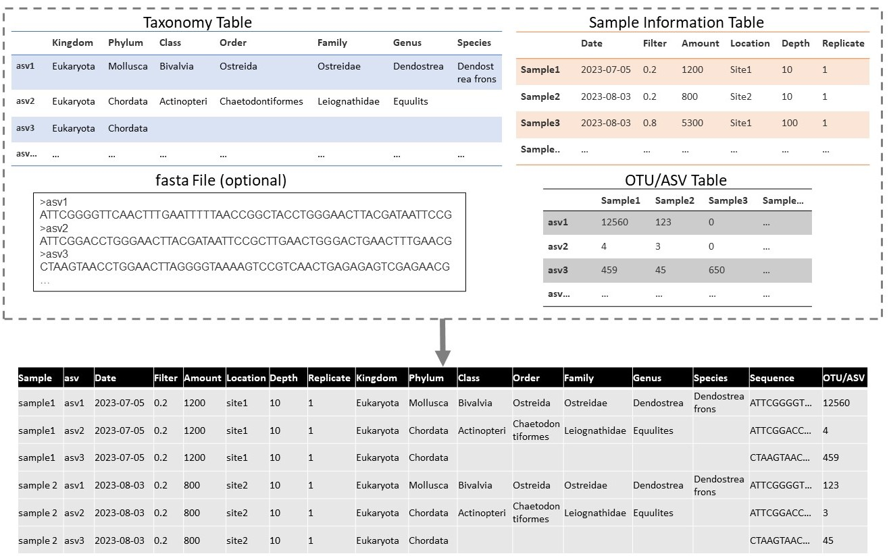
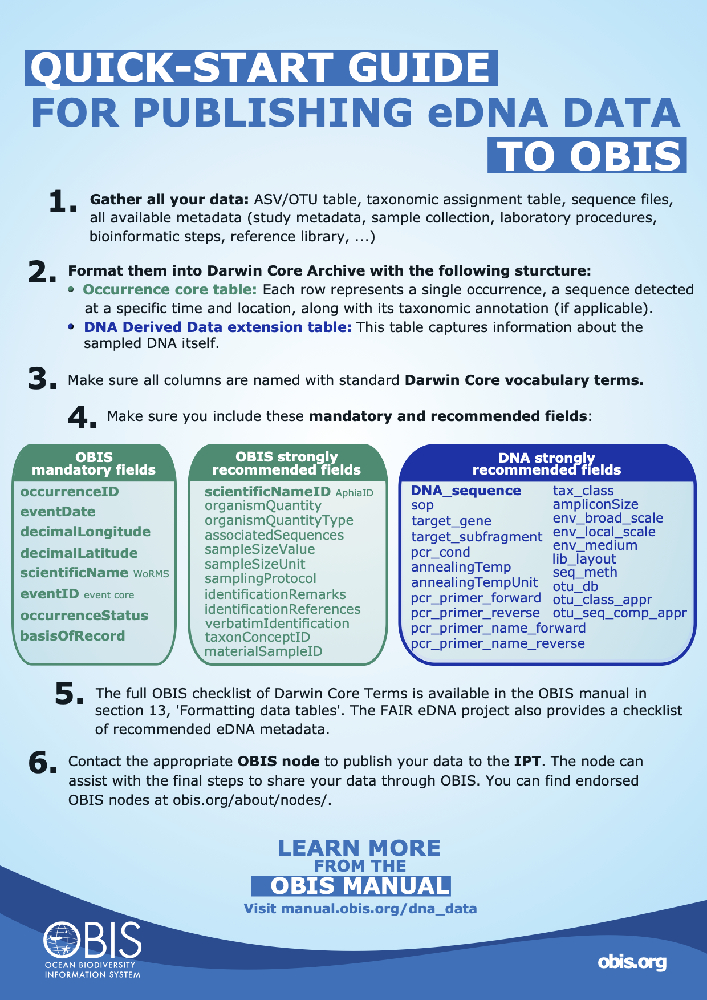
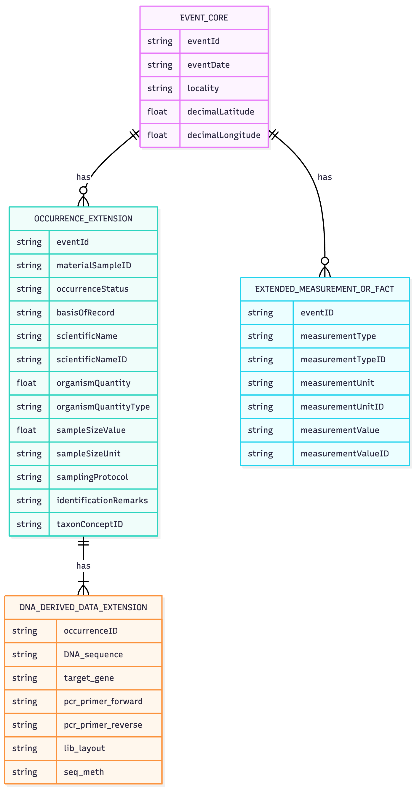
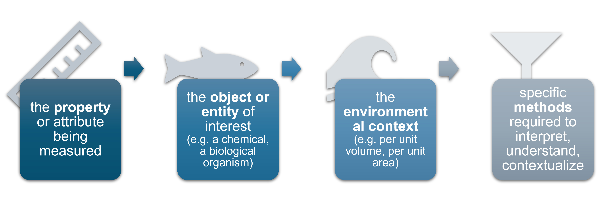
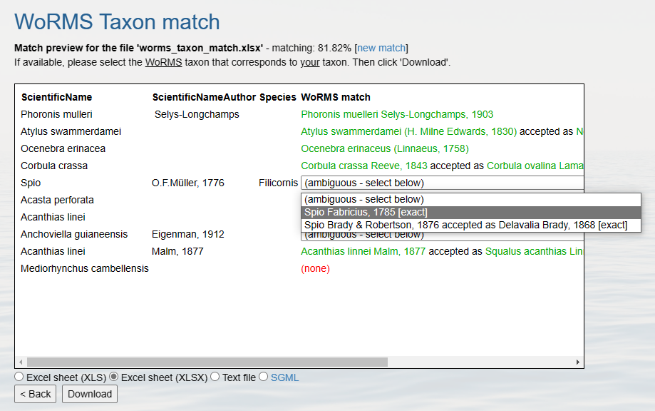

```{r}
#| label: setup
#| include: false

# Add packages as needed
```

::: {.callout-note icon=false}
##  Learning objectives

By the end of this episode, you will be able to:

- Describe what a Darwin Core Archive (DwC-A) is and how the DNA Derived Data extension incorporates MIxS terms.
- Identify which of GBIF's five DNA data categories fits your own dataset.
- Explain the "wide to long" transformation from raw sequencing outputs to Darwin Core occurrence records.
- List the key fields expected in the Occurrence core, the DNA extension, and the eMoF extension.
- Choose between an Occurrence Core and an Event Core table structure for your dataset.
- Describe how taxon matching against WoRMS works, and what to do when a sequence has no match.
:::

::: {.callout-important icon=false collapse=true}
## Prerequisites for this episode

- Completed [Episode 2: OBIS & Darwin Core](02-obis-darwin-core.qmd)
:::

---

## Darwin Core + the DNA Derived Data extension

**Darwin Core (DwC)** is a shared vocabulary for biodiversity data — a standard set of term names (`scientificName`, `eventDate`, `decimalLatitude`, and so on) so that data from any source can be combined and compared. The **DNA Derived Data extension** adds terms from **MIxS** (Minimum Information about any (x) Sequence) to capture sequences, primers, and methods. It was developed jointly by GBIF, OBIS, and the genomics community, so the same fields used for INSDC/GenBank submissions can be reused here.

A published dataset takes the form of a **Darwin Core Archive (DwC-A)**: a zip file containing a few linked pieces:

- **`meta.xml`** — links all the tables together
- **`eml.xml`** — dataset-level metadata (who, what, where, when, how)
- **`occurrence.csv`** — the occurrence records (the core table)
- **`dna_derived.csv`** — the DNA extension, linked to occurrence by `occurrenceID`

{fig-align="center" width="70%"}

For the full specification and worked examples, see the [DNA publishing guide](https://doi.org/10.35035/DOC-VF1A-NR22), *Publishing DNA-derived data through biodiversity data platforms*, produced jointly by GBIF and OBIS.

---

## Which data category fits your data?

Before mapping any fields, figure out which of GBIF's five DNA data categories describes your dataset:

| # | Category | Example |
|---|---|---|
| **1** | **DNA-derived occurrences** | Metabarcoding (ASVs/OTUs assigned to taxa) |
| 2 | Enriched occurrences | Voucher specimen + barcoded |
| **3** | **Targeted species detection** | qPCR / ddPCR assays |
| 4 | Name references | Sequence in GenBank only |
| 5 | Metadata only | Dataset without sequences |

Categories 1 and 3 are by far the most common for eDNA researchers: Category 1 covers metabarcoding, Category 3 covers targeted detection methods like qPCR/ddPCR where no sequences are produced. Use the [GBIF decision tree](https://docs.gbif.org/publishing-dna-derived-data/1.0/en/#data-packaging-and-mapping) if you're not sure which applies to you. The rest of this episode focuses on Category 1 (metabarcoding), which is what the exercise dataset in the next episode represents.

---

## From raw outputs to long format

DNA data is more complex than a simple latitude/longitude + species name record. A typical metabarcoding pipeline produces:

| File | Content |
|---|---|
| OTU/ASV table | Sequences × samples (read counts) |
| Taxonomy table | Sequence ID → taxon assignment |
| Sample metadata | Location, date, method |
| FASTA file | The actual DNA sequences |

The core transformation to remember for the rest of this training:

> One row = one unique sequence **in** one sample = one occurrence record

{fig-align="center" width="80%"}

The most common stumbling block when formatting eDNA data is exactly this "wide to long" transformation — turning an ASV table with one column per sample into one row per detection. We'll do this transformation by hand with `tidyr::gather()` in the next episode; if you're processing many datasets, the [Metabarcoding Data Toolkit](https://github.com/iobis/mdt) can automate it for common pipeline outputs.

---

## Key fields to include

### Occurrence core

::: {.columns}
::: {.column width="50%"}
**Mandatory fields**

- `occurrenceID` — unique, stable ID
- `scientificName` — matched via WoRMS
- `basisOfRecord` = `"MaterialSample"`
- `eventDate`, `decimalLatitude`, `decimalLongitude`
- `occurrenceStatus` = `"present"`
:::
::: {.column width="50%"}
**Strongly recommended fields**

- `scientificNameID` (WoRMS AphiaID)
- `organismQuantity` (read count of the sequence)
- `organismQuantityType` = `"DNA sequence reads"`
- `associatedSequences` (link to e.g. GenBank/ENA accession)
- `sampleSizeValue` / `sampleSizeUnit` (total reads in the sample)
- `samplingProtocol` (link to your SOP)
:::
:::

### DNA Derived Data extension

- `DNA_sequence` — the ASV/OTU sequence itself
- `target_gene` — e.g. `"COI"`, `"18S rRNA"`
- `pcr_primer_name_forward` / `pcr_primer_name_reverse`
- `seq_meth` — e.g. `"Illumina MiSeq"`
- `otu_class_appr` — e.g. `"DADA2 v1.18"`
- `otu_db` — the reference database used
- `sop` — link to your protocol

{fig-align="center" width="60%"}

More detail: [manual.obis.org/dna_data.html#quick-start-guide](https://manual.obis.org/dna_data.html#quick-start-guide).

::: {.callout-tip}
## Unidentified sequences still count

Every marine occurrence should ideally carry a WoRMS AphiaID as its `scientificNameID`. But sequences that can't be identified shouldn't be dropped — include them with the highest taxonomic rank you can confidently assign (see [Taxon matching](#taxon-matching-with-worms) below), since they can be re-identified later as reference databases improve.
:::

---

## Table structure options

There are two common ways to structure your tables:

**Option A — Occurrence Core**

```
occurrence.csv
  └── dna_derived.csv  (linked via occurrenceID)
  └── emof.csv         (linked via occurrenceID)
```

**Option B — Event Core** *(recommended for eDNA)*

```
event.csv
  └── occurrence.csv        (linked via eventID)
       └── dna_derived.csv  (linked via occurrenceID)
  └── emof.csv              (linked via eventID or occurrenceID)
```

**Why Event Core?** Sample-level metadata — location, date, method — is recorded **once** per sampling event rather than repeated on every row. For a survey with 500 samples × 2,000 ASVs, that's 1 million occurrence rows: repeating location and date on every single one is wasteful and error-prone.

{fig-align="center" width="70%"}

Concretely, a dataset built this way is three (or four) linked tables:

::: {.columns}
::: {.column width="33%"}
**Event Core** — the where, when & how of collection

- `eventID`, `eventDate`
- `decimalLatitude`, `decimalLongitude`
- `env_medium`, `samplingProtocol`
:::
::: {.column width="33%"}
**Occurrence Extension** — what organism was detected

- `occurrenceID`, `eventID`
- `scientificName`, `taxonID` (WoRMS)
- `basisOfRecord`, `occurrenceStatus`
:::
::: {.column width="33%"}
**DNA Derived Data Ext.** — the molecular context

- `occurrenceID`
- `DNA_sequence`, `target_gene`
- `pcr_primer_forward/reverse`, `seq_meth`
:::
:::

Tables are linked by `eventID` and `occurrenceID`. An optional fourth table, **eMoF**, carries measurements and facts (see below).

::: {.callout-tip}
## Which structure will this training use?

In the next episode you'll build an **Occurrence Core** dataset (Option A) — it's simpler for a first dataset with only two samples. Once you're comfortable with the mapping, switching to an Event Core is mostly a matter of splitting the sample-level columns into their own table.
:::

---

## The eMoF extension

The Extended MeasurementOrFact (eMoF) table records **all types of measurements** — abiotic, biotic, environmental, or related to sampling effort — in long format, linked to an `eventID` and/or `occurrenceID`. Each measurement is one row with a `measurementType`, `measurementValue`, and `measurementUnit`:

| eventID | occurrenceID | measurementType | measurementValue | measurementUnit |
|---|---|---|---|---|
| YEARsite1samp1 | | temperature | 25 | °C |

| measurementTypeID | measurementUnitID |
|---|---|
| `http://vocab.nerc.ac.uk/collection/P01/current/TEMPPR01/` | `http://vocab.nerc.ac.uk/collection/P06/current/UPAA/` |

Linking sampling info to `eventID` instead of repeating it per occurrence decreases duplication — the same principle as the Event Core structure above.

### Controlled vocabulary

Wherever possible, attach a **controlled vocabulary identifier** to each eMoF column:

- `measurementTypeID`
- `measurementUnitID`
- `measurementValueID` (for non-numeric values)

{fig-align="center" width="60%"}

Using identifiers rather than free text facilitates data understanding, enables data aggregation across datasets, and decreases the potential for misuse or misinterpretation. **OBIS recommends using [NERC vocabulary](http://vocab.nerc.ac.uk/) terms** wherever a suitable one exists.

---

## Taxon matching with WoRMS

Every `scientificName` in a marine dataset should resolve to a **WoRMS** (World Register of Marine Species) AphiaID. You can do this:

- Interactively with the [WoRMS Taxon Match Tool](https://www.marinespecies.org/aphia.php?p=match)
- Programmatically, with [`obistools::match_taxa`](https://iobis.github.io/obistools/#taxon-matching), [`worrms::wm_records_taxamatch`](https://docs.ropensci.org/worrms/reference/wm_records_taxamatch.html), or [`pyworms`](https://github.com/iobis/pyworms) in Python

{fig-align="center" width="60%"}

::: {.callout-tip}
## No exact WoRMS match?

Use the highest-rank taxon that *does* have a match (e.g. family or order) rather than leaving the record out. Keep the sequence — it can be re-identified later as reference databases improve.
:::

::: {.callout-note icon=false}
## Still no match at all?

Record completely unidentifiable sequences as:

- `scientificName` = `"Biota incertae sedis"`
- `scientificNameID` = `urn:lsid:marinespecies.org:taxname:12`
:::

We'll put this into practice with `obistools::match_taxa()` on a real dataset in the next episode.

---

## Key metadata by data type

The fields you need to capture depend on which stage of the workflow — and which method — produced your data.

**eDNA metabarcoding** (Category 1), from field to taxonomy:

- ⛵ **Field sampling** — date, coordinates, environmental measurements
- 🧬 **DNA extraction** — concentration, extraction method, extracted amount
- 🧪 **Biomarker/PCR** — primer sequence and reference, target gene, PCR conditions, product length, concentration
- 💻 **Sequences & taxonomy** — sequencing platform, library layout, public repository ID (NCBI/ENA), taxonomy, annotation confidence and reference, pipeline, reference library

**Quantitative PCR / qPCR** (Category 3) adds detection-specific fields on top of field sampling and DNA extraction:

- 🎯 **Target & quantity** — target gene region, primers, copy number, concentration, limit of detection (LOD), quantification cycle (Cq), baseline

qPCR differs from metabarcoding in one important way: because you're detecting one specific taxon, `scientificName` and `scientificNameID` are required from the start (rather than being resolved after the fact via taxon matching). Both use `basisOfRecord = "MaterialSample"`.

---

## Quality control, before you publish

Whichever structure and category you use, check the following before publishing:

- ✅ Taxonomy matched to WoRMS (AphiaID required for marine taxa)
- ✅ Coordinates in decimal degrees, and actually in the ocean
- ✅ Dates in ISO 8601 format (`YYYY-MM-DD`)
- ✅ Unique, stable `occurrenceID` and `eventID` values
- ✅ Table linkages consistent (`eventID`, `occurrenceID` match across tables)

| Tool | What it checks |
|---|---|
| `obistools` (R package) | Taxonomy, geography, required fields |
| GBIF data validator | Darwin Core Archive structure |
| WoRMS taxon match | Scientific names → AphiaIDs |

We'll run these checks with real code on a real dataset in [Episode 4](04-structuring-datasets.qmd).

---

::: {.callout-caution icon=false}
## 🧪 Exercise 3.1: Categorize and map your own data

Think of an eDNA dataset you work with (or plan to publish).

1. Which of the five GBIF data categories does it fall into?
2. Would an Occurrence Core or an Event Core structure suit it better, and why?
3. Pick three raw columns from your own data and say which Darwin Core or DNA extension term each one maps to.

::: {.callout-caution icon=false collapse=true}
## Solution

There's no single right answer here — it depends on your dataset. As a worked example: a metabarcoding survey with 50 sampling stations, each with multiple ASVs, is **Category 1**, and because sample-level metadata (site, date, depth) would otherwise be repeated across thousands of ASV rows, an **Event Core** structure is the better fit. A raw column like `read_count` would map to `organismQuantity` (with `organismQuantityType = "DNA sequence reads"`), a `primer_pair` column maps to `pcr_primer_name_forward`/`pcr_primer_name_reverse`, and a `sample_date` column maps to `eventDate` once reformatted to ISO 8601.
:::
:::

---

::: {.instructor-only}
::: {.callout-warning icon=false}
##  Instructor notes

**Estimated time:** 60 minutes

**Pacing notes:**

- This episode is conceptual — no code is run yet. Keep momentum by tying every concept back to the concrete example dataset learners will process hands-on in Episode 4.
- The Occurrence Core vs. Event Core decision (and the eMoF long-format idea) are the two concepts learners most often need repeated in the next episode — flag them as "you'll see this again in five minutes."

**Common errors:**

- Confusing `organismQuantity` (per-occurrence read count) with `sampleSizeValue` (total reads in the whole sample) — they're easy to conflate.
- Assuming Category 1 (metabarcoding) and Category 3 (qPCR) always require the same fields — qPCR requires `scientificName` up front; metabarcoding resolves it after taxon matching.
- Treating "no WoRMS match" as a reason to drop a row instead of using the highest matched rank or `Biota incertae sedis`.

**Discussion prompts:**

- Why does long-format data (used throughout DwC and eMoF) generalize better across datasets than a wide table with one column per measurement type?
- What would go wrong if two collaborators independently invented their own `measurementType` labels instead of using a controlled vocabulary?
:::
:::

---

::: {.callout-tip icon=false}
##  Key points

- A Darwin Core Archive bundles an occurrence core table with extensions (DNA Derived Data, eMoF) and dataset-level EML metadata into one zip file.
- Figure out your GBIF data category (metabarcoding vs. targeted detection are the two most common) before you start mapping fields.
- The core transformation for eDNA data is wide-to-long: one row per sequence, per sample.
- Use an Event Core structure when sample-level metadata would otherwise be repeated across many occurrence rows.
- Every scientific name should resolve to a WoRMS AphiaID where possible; unmatched sequences are kept, not dropped.
:::

::: {.callout-note icon=false collapse=true}
## Further reading

- [Publishing DNA-derived data through biodiversity data platforms](https://doi.org/10.35035/DOC-VF1A-NR22) — the joint GBIF/OBIS DNA publishing guide
- [OBIS Manual: DNA data](https://manual.obis.org/dna_data.html)
- [GBIF decision tree for DNA data categories](https://docs.gbif.org/publishing-dna-derived-data/1.0/en/#data-packaging-and-mapping)
:::
