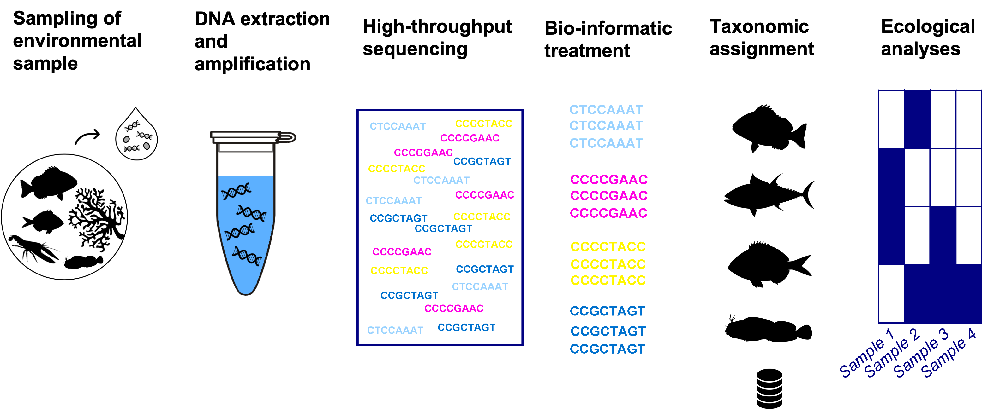

<!-- Replace the banner image below with a relevant one for your lesson -->
{fig-alt="An example of eDNA workflows beginning with sampling the environment and ending with taxonomic assignment and ecological analyses." width=100%}

## Overview

This online course is aimed at beginners who are new to publishing eDNA data to OBIS and GBIF. It is meant to provide an introduction to DNA data and its management. We cover topics including background information on what eDNA is, the key aspects of collecting, extracting, and sequencing DNA data, and an example of how to format DNA data table outputs into Darwin Core for publishing to OBIS.

This course is not meant to provide advanced knowledge and instead focuses on providing a solid foundation for DNA data.

::: {.callout-tip}
## Supporting Slides

**Supporting slides used by instructors can be found: <https://iobis.github.io/obis_edna_slides/>.**
:::

## Learning outcomes

By the end of these lessons, you should be able to:

- Define environmental DNA (eDNA) and explain how it differs from traditional biodiversity surveys
- Understand the typical output from DNA pipelines - ASV tables, FASTA files for sequences, taxonomy files, and sample metadata - and how to load them into R.
- Explain the "wide to long" transformation from raw sequencing outputs to Darwin Core occurrence records.
- Combine DNA output tables into Darwin Core tables, mapping raw fields to Darwin Core terms.
- Describe how taxon matching against WoRMS works, and what to do when a sequence has no match.

## Prerequisites

::: {.callout-important icon=false}
## Prerequisites

This course assumes you have a basic understanding of:

- Darwin Core data formatting
- Coding in R
:::

## Episodes

```{r}
#| label: episode-table
#| echo: false
#| results: asis

lang <- rmarkdown::metadata$lang
if (is.null(lang)) lang <- "en"

# Canonical (English) episode files only - translated ".es.qmd" counterparts
# are matched below, not listed as separate episodes.
files <- sort(list.files("episodes", pattern = "\\.qmd$", full.names = FALSE))
files <- files[!grepl("\\.[a-z]{2}\\.qmd$", files)]

rows <- lapply(seq_along(files), function(i) {
  base <- files[i]
  translated <- sub("\\.qmd$", paste0(".", lang, ".qmd"), base)
  use_translated <- lang != "en" && file.exists(file.path("episodes", translated))
  file <- if (use_translated) translated else base
  path <- file.path("episodes", file)
  lines <- readLines(path, n = 20)

  get_field <- function(field) {
    line <- grep(paste0("^", field, ":"), lines, value = TRUE)[1]
    if (is.na(line)) return("NA")
    trimws(gsub(paste0("^", field, ":\\s*[\"']?|[\"']?$"), "", line))
  }

  data.frame(
    `#` = i,
    Episode = sprintf("[%s](%s)", get_field("title"), path),
    Description = get_field("description"),
    Time = get_field("time"),
    check.names = FALSE
  )
})

knitr::kable(do.call(rbind, rows))
```


## Setup

Most of the content in this course is conceptual, however Episode 4 provides a data formatting example with R. Before the fourth episode, please complete the [Setup instructions](setup.qmd).
These cover software installation, package installation, and downloading the example dataset.

## How to use these materials

These materials can be used for **self-paced study** or as part of an **instructor-led workshop**.

- **Self-paced:** Work through each episode in order.
- **Instructor-led:** Your instructor will guide the pace. Exercises will be worked through
  together or in small groups.

Tip boxes, challenge boxes, and key-point summaries appear throughout. Take time to read them -
they highlight common mistakes and the most important concepts.

## Acknowledgements

This course was developed as part of the [Ocean Biodiversity Information System (OBIS)](https://obis.org)
training programme.

Lesson design follows the pedagogical framework of
[The Carpentries](https://carpentries.org), whose
[Curriculum Development Handbook](https://cdh.carpentries.org) informed the structure of these
materials. Content is original and independent; this is not an official Carpentries lesson.

Maintained by . Licensed .

---

*This lesson was last rendered on `r Sys.Date()`.*
